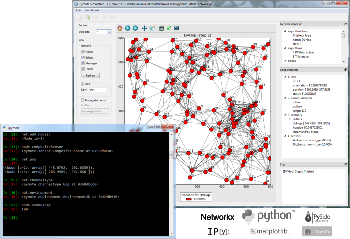

Pymote
======
Pymote is a Python package for event based simulation and evaluation of distributed algorithms.

Definition of distributed environment used as specifications for making Pymote are taken mainly from `Design and Analysis of Distributed Algorithms <http://eu.wiley.com/WileyCDA/WileyTitle/productCd-0471719978,descCd-description.html>`_ by Nicola Santoro.

Pymote's main goal is to provide framework for fast implementation and simulation of distributed algorithms. In its current initial state it is mainly targeted at algorithms for wireless (sensor) networks but it could be applied to any distributed computing environment (e.g., distributed systems, grid networks, internet, etc.).

   
   Pymote is being developed on top of `NetworkX <https://github.com/networkx/networkx/>`_ and is ment to be used along other scientific packages such as SciPy, NumPy and matplotlib. Currently, gui runs on PySide (Qt bindings) and console is jazzy IPython.

Installation
------------

For installation instructions please visit `documentation <https://pymote.readthedocs.org>`_.

Literature
----------

Santoro, N.: *Design and Analysis of Distributed Algorithms*, 2006 `link <http://eu.wiley.com/WileyCDA/WileyTitle/productCd-0471719978,descCd-description.html>`_

Arbula, D. and Lenac, K.: *Pymote: High Level Python Library for Event-Based Simulation and Evaluation of Distributed Algorithms*, International Journal of Distributed Sensor Networks, Volume 2013 `link <http://www.hindawi.com/journals/ijdsn/2013/797354/>`_
