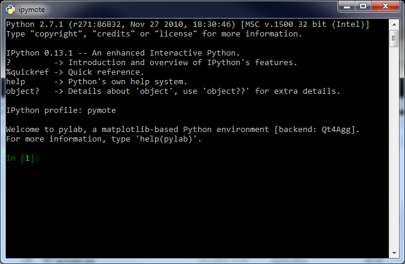

Starting Pymote
***************
Pymote can be used in many different ways and here are some few recommended ways to start it.

Interactive console (IPython)
-----------------------------
To use Pymote from the interactive console (IPython) start provided program 
``ipymote`` (in Windows ``ipymote.exe``) with previously activated virtual environment::
    
    (pymote_env)> ipymote
.. note::

    **Windows only**
    
    The recommended way to avoid starting command prompt, activating the virtual environment and
    running ``ipymote`` in is to make a shortcut to the ``ipymote.exe`` file on the desktop, 
    taskbar or start menu.

    This way console can be additionaly customized by right clicking on the shortcut and selecting
    Properties from the menu. Highly recommended customizations are:

    * in Options tab enable QuickEdit mode
    * in Font tab change font to Consolas and size to 16
    * in Layout tab increase Screen buffer size Height from 300 to at least 3000

    The loading of the correct environment when shortcut is double clicked is possible via
    previously set ``PYMOTE_ENV`` environment variable which points to the environment location.

..
    **For linux**
    
    In ``~/.profile`` or (if exists) ``~/.bash_profile`` file append line::

        export PYMOTE_ENV="/path/to/pymote_env"

    and restart terminal.
    
    Add shortcut...

IPython can also be started by starting IPython directly and using dedicated ``pymote`` profile::

    (pymote_env)> ipython --profile=pymote

.. note::

    Pymote profile files should be present inside 
    ``pymote_env/.ipython/profile_pymote/ipython_config.py``
    or ``~/.ipython/profile_pymote/ipython_config.py`` file created during Pymote installation.

Simulation GUI
--------------
Pymote features simulation GUI which can be started as standalone application using 
``pymote-simgui`` (in Windows ``pymote-simgui.exe``). The other very convenient way of starting and
working with the GUI is from the interactive console by running ``simulationgui.py`` like this::

    In [1]: %run pymote_env/Lib/site-packages/pymote/gui/simulationgui.py

The gui event loop is separated from the console. Simulation window can be accessed by using 
``simgui`` and network in the simulator window by using ``simgui.net`` so all simulation objects 
(network, nodes, messages...) are fully inspectable and usable via console.

