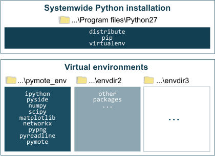

Installation
############
This document assumes you are familiar with using command prompt or shell. It should outline the necessary steps to install software needed for using Pymote.

Requirements
************
    
* `Python`_ 2.7
* `Setuptools`_ 
* `NumPy`_
* `SciPy`_
* `Matplotlib`_
* `PySide`_ (for gui)
* `IPython`_ 0.13.1
* `NetworkX`_
* `PyPNG`_ 

.. _Python: http://www.python.org
.. _Setuptools: http://pypi.python.org/pypi/setuptools
.. _NumPy: http://numpy.scipy.org
.. _SciPy: http://www.scipy.org
.. _Matplotlib: http://matplotlib.org/
.. _PySide: http://qt-project.org/wiki/PySide
.. _IPython: http://ipython.org/
.. _NetworkX: http://networkx.lanl.gov/
.. _PyPNG: https://github.com/drj11/pypng

If you don't have all required packages already installed and/or want them installed in an isolated environment (see note below) please follow the instructions for your OS in the following sections.

.. _discourage-systemwide:

..  note::
    
    Since there can be only one version of any package installed systemwide in some cases this can result in situation where two programs need different versions of the same package. This is resolved by using isolated virtual environments.

   
   Virtual environments *live* in a separate directories and they are independent form systemwide Python installation.
   
Alternatively, if none of the above is your concern, although not recommended, all required packages can be installed systemwide using their respective instructions for appropriate OS and then Pymote can be installed by using::

    > pip install pymote

Windows
*******
Windows version can be installed in an isolated environment very easy:

#. Install `WinPython <https://code.google.com/p/winpython/>`_. WinPython has included python and all required packages inside simple exe installer and they are all installed one relocatable [*]_ directory.

    .. [*] After directory reloacation change links in headers of ``Scripts/ipymote`` and ``Scripts/pymote-simgui`` and paths in ``Lib/site-packages/easy_install.pth`` and ``Lib/site-packages/Pymote.egg-link``.

#. Run ``WinPython Command Prompt.exe`` located in WinPython installation dir and install latest official version of Pymote with ``pip install pymote`` 

..  note::

    For latest development version instead of ``pip intall pymote`` use ``pip install -e git+https://github.com/darbula/pymote.git#egg=Pymote`` and for upgrade after git pull use run ``python setup.py develop`` inside pymote dir.

For starting Pymote interactive console just run ``ipymote`` from the WinPython Command Prompt, and for simulation GUI run ``pymote-simgui``. For more details refer to :doc:`starting`.

Alternatively, installation can be done using :doc:`windows_virtualenv` but it is much more involved and not recommended.

Linux (Ubuntu)
**************

Python 2.7 should already be installed on all new releases of Linux.

Install packages required for getting and compiling the source::
    
    $ sudo apt-get install git libatlas-dev libpng12-dev libfreetype6 libfreetype6-dev g++ libzmq-dev liblapack-dev gfortran python-dev build-essential

Virtualenv
==========

Install pip and virtualenv::
    
    $ sudo apt-get install python-pip python-virtualenv

Create virtual environment::
    
    $ virtualenv pymote_env --system-site-packages

.. warning::

    If you want to avoid using `--system-site-packages` then PySide package has to be installed in virtualenv which is slightly involved or time and disk-space consuming. Both procedures are described below in PySide section.
    
.. _linux-venvact:

Activate virtual environment::
    
    $ source pymote_env/bin/activate

Required packages
=================
Install required python packages into virtual environment::
    
    (pymote_env)$ pip install numpy scipy ipython matplotlib networkx pypng distribute

IPython notebook
----------------
Optionally for IPython notebook install these::

    (pymote_env)$ pip install tornado pyzmq pygments
    
PySide
------
Installing PySide into virtual environment can take some skill or time and disk space. To avoid this, it can be installed systemwide (if `--system-site-packages` option is used when creating virtualenv, as noted above) using `these instructions <http://qt-project.org/wiki/PySide_Binaries_Linux>`_ or simply like this::

    $ sudo add-apt-repository ppa:pyside
    $ sudo apt-get update
    $ sudo apt-get install python-pyside

If you really want to install PySide into virtual environment quick option is to follow `this solution <http://stackoverflow.com/a/1962076>`_ or simmilar and even better `solution <http://stackoverflow.com/a/8160111>`_ 

More time consuming option is to use pip. In this case you'll have to install packages needed for compilation using following commands::

    $ sudo apt-get install cmake qt4-qmake qt-sdk
    (pymote_env)$ pip install pyside

Pymote
======
Finally, in order to download and install Pymote and all other required packages there are two aviliable options, use one of them:

#. *Stable*: for latest stable version use package from PyPI::
    
    (pymote_env)> pip install pymote

#. *Development*: to install latest development version of the Pymote use source from github repo::
    
    (pymote_env)> pip install -e git+https://github.com/darbula/pymote.git#egg=Pymote

Starting Pymote
===============

Before starting, make sure that virtual environment is :ref:`activated <linux-venvact>` and run ``ipymote`` for interactive console or ``pymote-simgui`` for simulation GUI. For more details refer to :doc:`starting`.

.. 
    Ubuntu
    ******
    http://cysec.org/content/installing-matplotlib-and-numpy-virtualenv
    **TODO**.
    
    curl -O http://python-distribute.org/distribute_setup.py
    python distribute_setup.py
    easy_install pip

    Mac OSX
    *******

    **TODO** 

.. _virtualenv: http://www.virtualenv.org/
